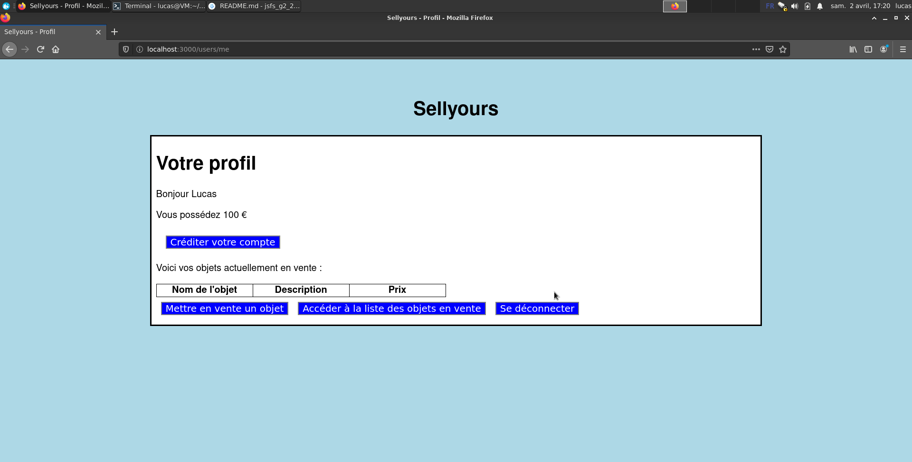
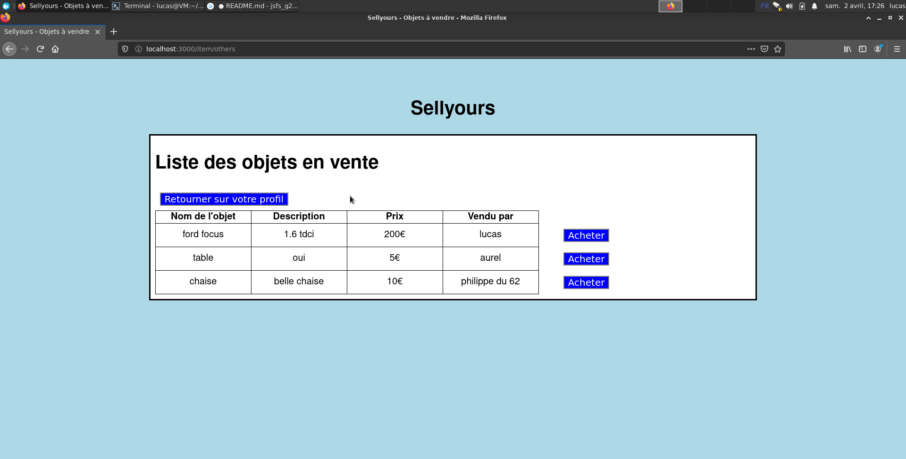
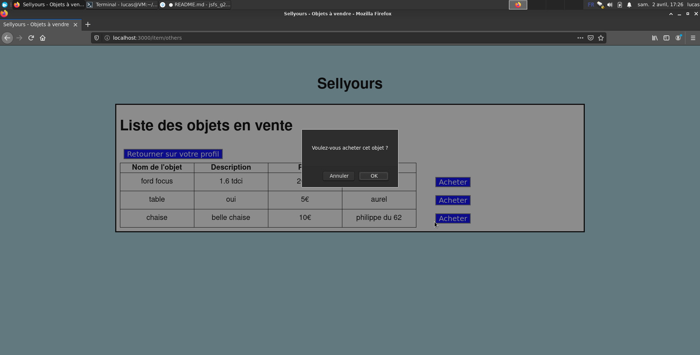
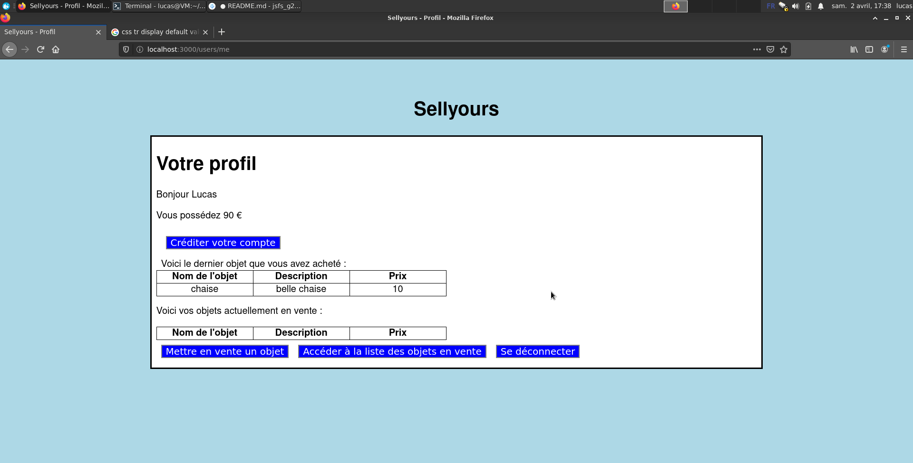

# Sellyours - Lucas Plé

## Lancement
Après avoir clôné ce dépôt, installez les dépendances :
```
cd tp4/sellyours
npm install
```

Pour lancer le serveur de base de données :
```
mdkir dbData
mongod --dbPath dbData
```

Pour lancer le serveur web :
```
npm run start
```

Pour vous connecter sur le site :

http://localhost:300

## Fonctionnement
Cette application est une Single Page App permettant de mettre en vente et d'acheter des objets, avec un système de compte.

Pour réaliser toutes les opérations nécessaires au fonctionnement du site, il dispose d'une API qui tourne directement sur le serveur web créé avec `Express`.

| URI                      | Opération    | Réponse                                                              |
| :----------------------- | :----------  | :------------------------------------------------------------------  |
| /users/me                | GET          | permet d'accéder à sa page de profil                                 |
| /users/me/money          | PUT          | permet de créditer son compte                                        |
| /access/login            | GET          | permet d'accéder à la page de connexion du site                      |
| /access/login            | POST         | adresse à laquelle envoyer les informations de connexion             |
| /access/logout           | GET          | permet d'accéder à la page de déconnexion                            |
| /access/register         | GET          | permet d'accéder à la page de création de compte                     |
| /access/register         | POST         | adresse à laquelle envoyer les informations de création de compte    |
| /item                    | GET          | permet d'accéder à la page de mise en vente d'objet                  |
| /item                    | POST         | adresse à laquelle envoyer les informations de création d'objet      |
| /item/others             | GET          | permet d'accéder à la page listant les objets en vente               |
| /item/:itemId            | DELETE       | permet de supprimer un objet de la vente en donnant son ID           |
| /item/:itemId/price      | PUT          | permet de modifier le prix de vente d'un objet                       |
| /buy/:itemId             | PUT          | permet d'acheter un objet à un autre utilisateur                     |

Ces routes sont gérées par des `Router` définis grâce à `Express`. 

Côté utilisateur, ce site comporte 6 pages : 
* la page de connexion
* la page de création de compte
* la page de déconnexion
* la page de profil
* la page de mise en vente d'un objet
* la page des objets achetables mis en vente par d'autres utilisateurs

Le système de connexion du site utilise `jwt` et est repris de la partie authentification du cours. 

Les utilisateurs et les objets sont les seules informations enregistrées en base de données.

Un utilisateur est définit par les informations suivantes :
* son login
* son mot de passe
* l'argent qu'il possède

Un objet est définit par les informations suivantes :
* le nom de l'objet
* une description de l'objet
* son prix
* l'identifiant de l'utilisateur qui le vend

Lorsqu'il se connecte, l'utilisateur est redirigé vers sa page de profil où il peut voir l'argent qu'il possède, mettre en vente des objets et accéder à la liste des objets en vente.



Il peut ainsi contrôler son compte en naviguant sur le site.

Lorsque l'utilisateur souhaite réaliser une action qui va changer un attribut de son compte sur le site (mise en vente d'un objet, achat, crédit supplémentaire sur le compte) une confirmation lui sera demandée et, s'il confirme, la page sera mise à jour avec la nouvelle donnée.

Par exemple, voici une séquence d'interaction type lorsque l'utilisateur achète un objet :

L'utilisateur voit tous les objets mis en vente.


Il choisit d'acheter la chaise qui est en vente et le site lui demande de confirmer son achat.


Il voit que son compte a été débité et que le dernier objet qu'il a acheté n'est autre que la chaise qu'il vient d'acheter.


Ce fonctionnement s'applique à toutes les actions que l'utilisateur peut réaliser sur ce site.

Lorsqu'il clique sur le bouton "se déconnecter", l'utilisateur est automatiquement redirigé sur la page de connexion 1,5s après avoir accédé à la page lui indiquant qu'il est déconnecté.

Le projet ne contient aucun fichier html car ce sont les vues créées avec `pug` qui permettent de générer l'html dynamiquement. Le rendu est fait lorsque le serveur répond à une requête sur une route pour que l'utilisateur soit dirigé correctement sur la page qui l'intéresse. 

Ce mode de fonctionnement permet également de passer des paramètres à la génération html, ce qui est notamment fait lors de l'affichage des objets mis en vente. Tous les objets trouvés dans la base de données qui sont vendus par des utilisateurs autres que l'utilisateur courant sont passés en paramètre au rendu du fichier `pug` et ce dernier va créer un tableau avec autant de ligne que d'objets en vente. C'est grâce à ça que le tableau peut être vide comme il peut contenir plus de 10 éléments. Cela permet également de ne pas avoir l'effet de chargement de page sur le navigateur car on ne change jamais réellement de page, c'est simplement le contenu qui est changé via ce rendu.